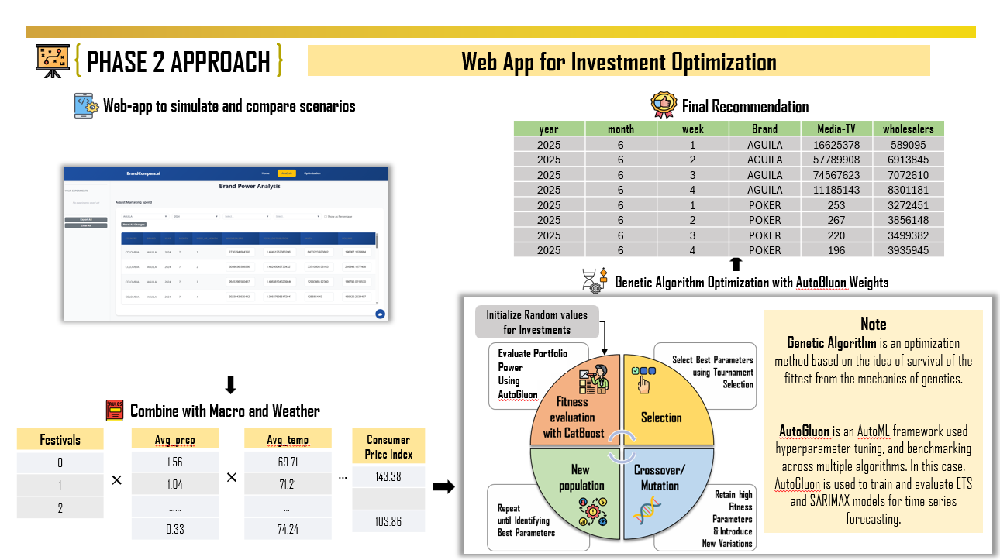

# Team Brewtal Coders

---

## 📋 Agenda

1. Business Problem  
2. Phase 1 Approach  
3. Phase 2 Approach  
4. Demo  
5. Business Impact  
6. Next Steps  

---

## 🧩 Business Problem

**What are we solving?**  
Optimize marketing investments that can control *Brand Power.*

---

## 🚀 Phase 1 Approach

**Goal:** Improve accuracy of *Brand Power Forecast*

**How did we solve it?**  
- Used **AutoGluon**, an AutoML framework, for hyperparameter tuning and benchmarking  
- Trained and evaluated **ETS** and **SARIMAX** models for time series forecasting  
- Combined results with **macro** and **weather** data  

!!! note
    **Genetic Algorithm (GA)** is an optimization technique inspired by natural selection (“survival of the fittest”).  

---

## ⚙️ Phase 2 Approach

**Objective:** Build a **Web App** for investment optimization  

- Simulate and compare marketing spend scenarios  
- Optimize portfolio using **multi-objective optimization (NSGA-II)**  
- Adjust results using **business rules, constraints, and preferences**  

**Final Recommendation:**  
Combine macroeconomic and weather data to improve robustness  

---

## 💻 Demo

**Evaluate Portfolio Power Using AutoGluon**

- Interactive dashboard to simulate investment scenarios  
- Model selection and tuning performed via **AutoGluon**  
- Power uplift estimation visualized for each portfolio  

---

## 🧭 Next Steps

- Input Data Preparation  
- Multi-objective Optimization using **NSGA-II**  
- Adjust based on **business rules and preferences**  
- Integrate **Reinforcement Learning** for adaptive intelligence  
- Collect **user feedback** for continuous improvement  
- Conduct **A/B Testing** for validation  

---

## 🙌 Thank You

Special thanks to:  
- The **Organizing Team**  
- The **Judges**  

